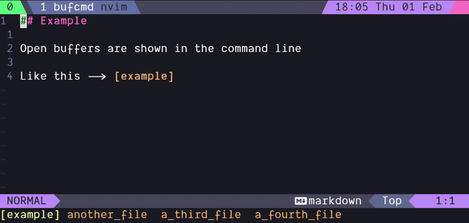

<div align="center">

### BufCmd

###### a minimal alternative to buffer lines

[](http://www.lua.org)
[](https://neovim.io)

<br />



</div>
<br />

### Why do I exist?

Most of the time, your command line sits around taking up a whole row without being useful. This plugin fills that dead space with your buffers, while still allowing messages to get through.

### Installation

Install with your favourite package manager.

```lua
-- lazy.nvim
{
  "jradam/bufcmd",
  opts = { },
}
```

### Options

These are the default options.

```lua
opts = {
  max_name_length = 20,
  show_extensions = false,
  compensation = 12,
  chars = {
    max_string = " ... ",
    left_brace = "[",
    right_brace = "]",
    modified_left = "",
    modified_right = "+",
    nameless_buffer = "-",
  },
  theme = {
    active = { fg = "", bg = "" },
    other = { fg = "", bg = "" },
    modified = { fg = "", bg = "" },
    active_modified = { fg = "", bg = "" },
  },
  keys = {
    next_buffer = "<Tab>",
    prev_buffer = "<S-Tab>",
    close_buffer = "<leader>x",
    close_others = "<leader>z",
    start_bufcmd = "<leader><Tab>",
    stop_bufcmd = "<leader><S-Tab>",
    run_compensation_test = "<leader>T",
  },
}
```

### Troubleshooting

If you continuously see...

> Press ENTER or type command to continue

...in your command line, you need to set a higher `compensation` value. You can run the included test (run_compensation_test) to find the exact best value for your editor.

### Other buffer management tools

- [bufferline.nvim](https://github.com/akinsho/bufferline.nvim)
- [barbar.nvim](https://github.com/romgrk/barbar.nvim)

### Credits

- [Bailey Ling](https://github.com/bling) for inspiring this project with [vim-bufferline](https://github.com/bling/vim-bufferline)
- [Zevv](https://www.vim.org/account/profile.php?user_id=10887) for coming up with the original [idea](https://www.vim.org/scripts/script.php?script_id=1664)
- [Max Shen](https://m4xshen.dev/) for this excellent Neovim [plugin guide](https://m4xshen.dev/posts/develop-a-neovim-plugin-in-lua/)
